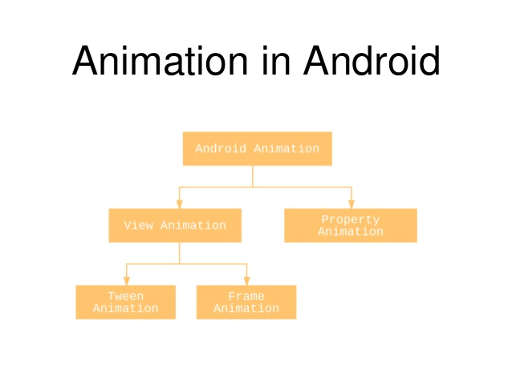

# Тема: Анимация

[Видео занятия](https://youtu.be/66BtINRsIao)

Вопросы:

* 	Виды анимации
	*	Tweened View Animations
	*	AlphaAnimation
	*	RotateAnimation
	*	ScaleAnimation
	*	TranslateAnimation
*	Frame Animations
*	Interpolated Property Animations
*	Примеры создания и использование анимации

	
## Полезные ссылки

* [AnimationDrawable](https://developer.android.com/reference/android/graphics/drawable/AnimationDrawable)
* [View Animation](https://developer.android.com/guide/topics/graphics/view-animation.html)
* [Animation](http://www.bogotobogo.com/Android/android19Animation.php)

